# Challenge

## Prerequisites

- Clone this repository to your machine.
- Do not change the repository structure. If you change it, let us know why in the README.
- Write your code in a clear and professional manner. Avoid using any sketchy or poorly written code as it will not allow us to accurately evaluate your skills.
- In case of any questions regarding the challenge, please, contact a member of the hiring team who shared this challenge with you.

## Introduction

This is a minimal Create React App SPA that includes:

- A theme for styling.
- Pre-built components for you to use in the project. You should be able to locate them.
- A fake REST API for data fetch.

### Notes

- The challenge _must_ be implemented using TypeScript.
- Data fetching _must_ be handled using Redux.
- Any _open-source_ library can be used, except for [Redux Toolkit](https://redux-toolkit.js.org/).
- The use of Redux Toolkit is _not_ allowed. This is to evaluate the candidate's understanding of the building blocks of Redux.
- Expected completion duration: about 3 hours.

## Tasks

### 1) Show all tournaments

#### 1.A) Show `Loading tournaments ...` while fetching:

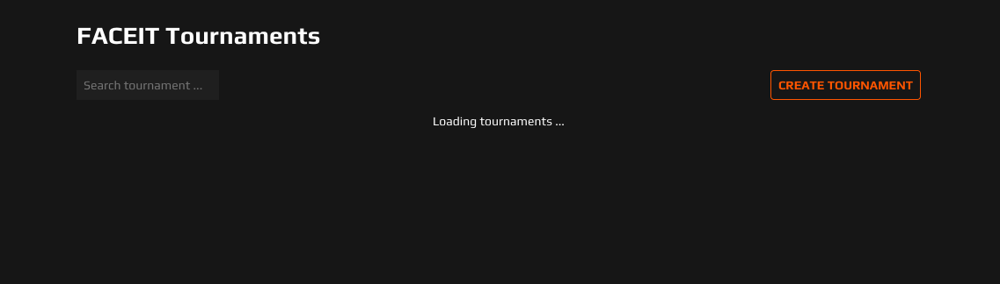

#### 1.B) Show `Something went wrong.` with a `RETRY` button when the fetching has failed:

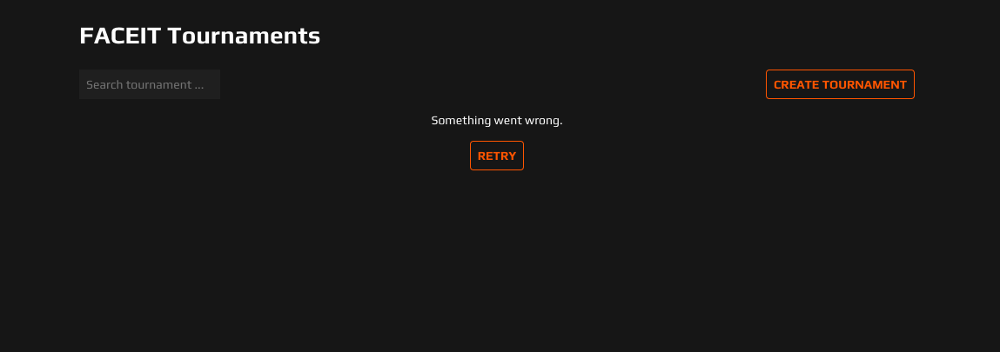

- Pressing the `RETRY` button will retry the fetching.

#### 1.C) Show all tournaments when the fetching has succeeded:

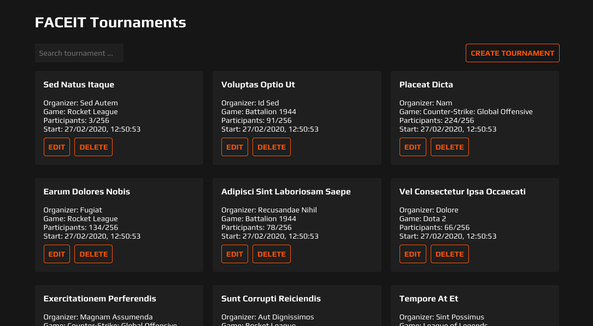

#### 1.D) Show `No tournaments found.` when the fetch result is empty:

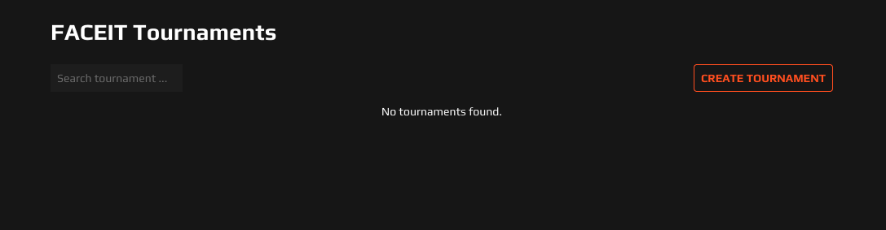

### 2. Edit a tournament

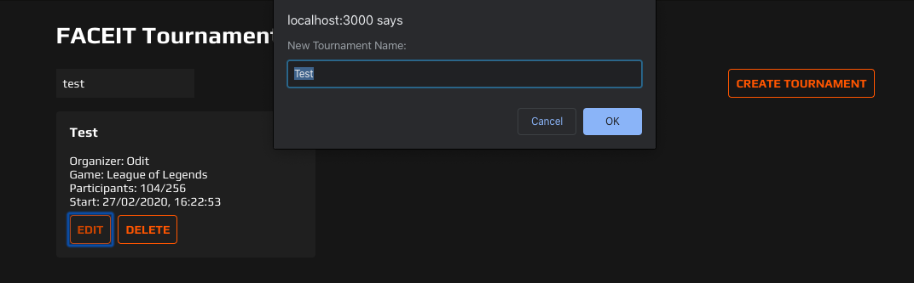

- Pressing the `EDIT` button opens a browser prompt with the prompt message `New Tournament Name:`, an input field with the current tournament name as pre-filled value and buttons `Cancel` to cancel and `OK` to confirm.
- The tournament name must contain only Latin letters, numbers, and spaces, not an empty string or only spaces.
- When `OK` is selected, the tournament name updates immediately in the UI through an "optimistic update" with rollback, without any loading indicators.

### 3. Delete a tournament

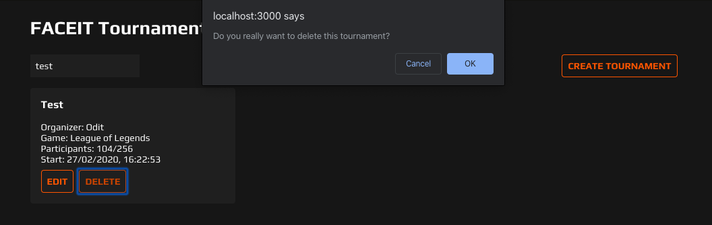

- Pressing the `DELETE` button opens a browser prompt with the message `Do you really want to delete this tournament?` and the buttons `Cancel` to cancel and `OK` to confirm.
- When `OK` is selected, the tournament is deleted immediately in the UI using an "optimistic delete" with rollback, without any loading indicators.

### 4. Search tournaments

Requirements:

- The search function should call the endpoint with the search term, rather than searching through local data.
- The search should trigger on user input, not by pressing the Enter key.

#### 4.A) Add a search input field labeled `Search tournament ...`:

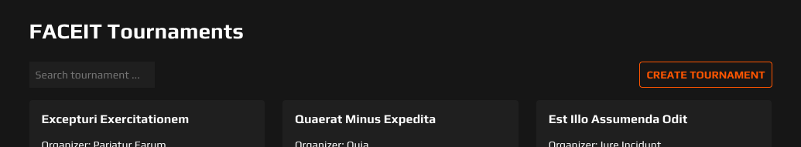

#### 4.B) Display `Loading tournaments ...` while data is being fetched:

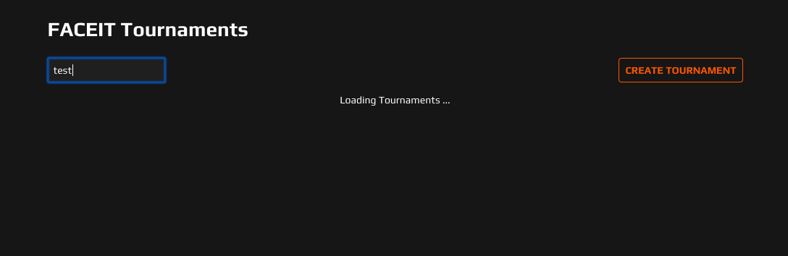

#### 4.C) Display `Something went wrong.` with a `RETRY` if the data fetch fails:

- Pressing the `RETRY` button retries the data fetch.

#### 4.D) Display all tournaments from the search results if the data fetch is successful:

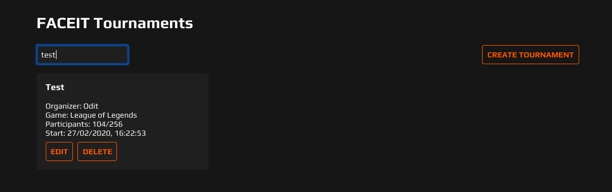

#### 4.E) Show `No tournaments found.` if the search result is empty:

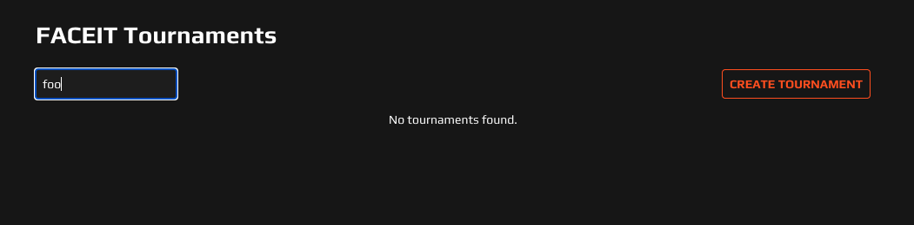

#### 4.F) Optimize the search functionality for performance.

### 5. Create a tournament

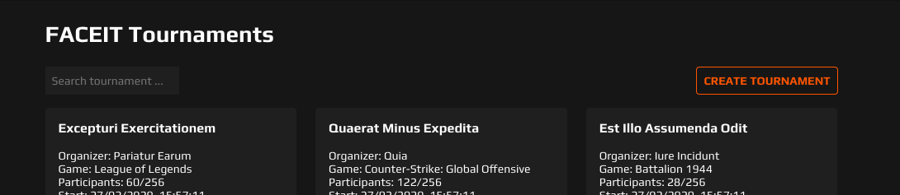

- Add a button labeled `CREATE TOURNAMENT`.

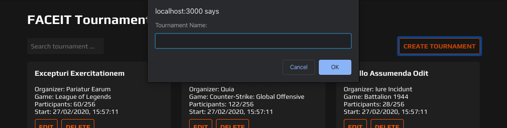

- Pressing the `CREATE TOURNAMENT` button opens a browser prompt with the message `Tournament Name:`, an input field to enter the tournament name, and the buttons `Cancel` to cancel and `OK` to confirm.
- The tournament name must contain only Latin letters, numbers, and spaces, not an empty string or only spaces.
- When `OK` is selected, the tournament is created on the fake REST API and at the start of the tournament list without any loading indicators.

### 6. Style it

- Tournaments have a border radius of `4px`.
- The tournament name uses the heading size `h6`.
- The `Start` date is displayed in the format `DD/MM/YYYY, HH:mm:ss` (`en-GB` locale).
- The horizontal spacing between the `EDIT` and `DELETE` buttons is `8px`.
- The horizontal and vertical spacing between each tournament is `24px`.

### 7. Make it responsive

- Examples of the expected layout on different screen sizes are provided:

- iPhone 12 Pro Max (428x926):

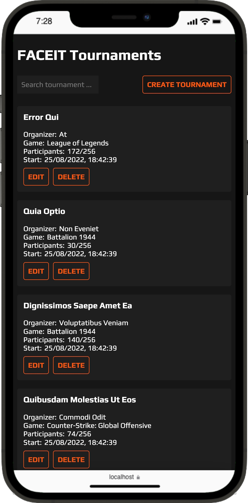

- iPad (768x1024):

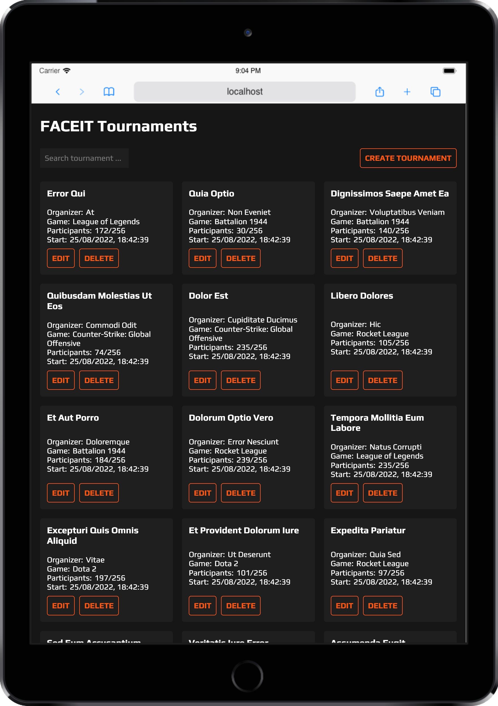

- Laptop 13" (1280x800):

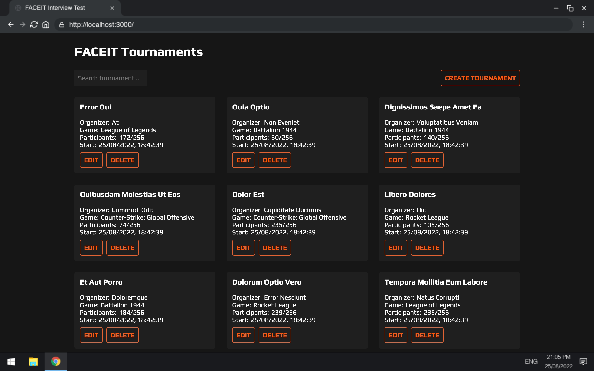

- iMac Retina 27" (2560x1440):

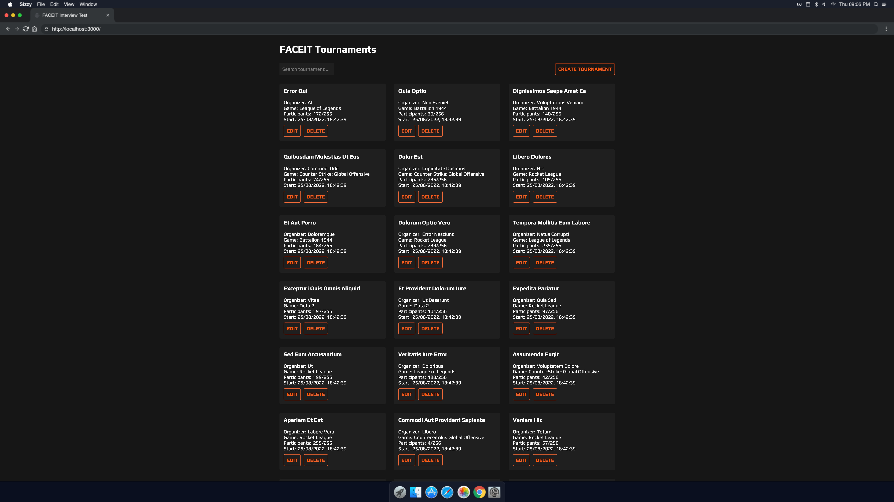

## Submission instructions

- Create a `ZIP` file with your solution.
- Include the .git folder to the `ZIP` file to facilitate code review.
- Send the `ZIP` file to the recruiter who provided this challenge.
- Do not include the `node_modules` folder in the `ZIP` file.
